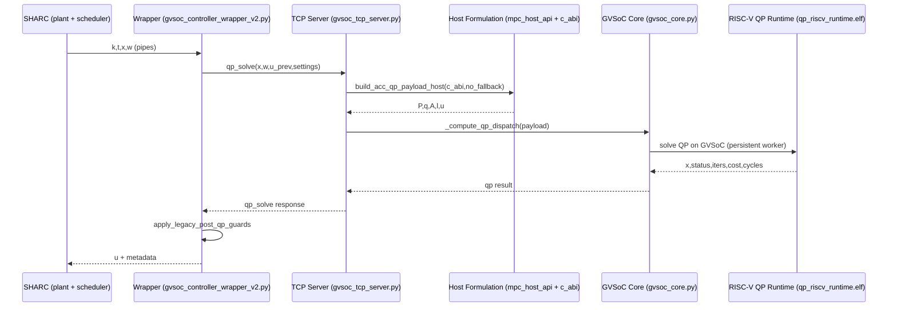

# Estado Funcional + Uso del Entorno + Flujo Completo

Fecha de referencia: 2026-03-04

## 1) Que tenemos funcional ahora mismo

Estado actual en modo oficial:
1. Dinamicas y lazo de simulacion en SHARC/host.
2. Transporte oficial wrapper->servidor por TCP.
3. Formulacion QP en host con backend `c_abi` (sin fallback en ruta oficial).
4. Solve QP en RISC-V/GVSoC con runtime persistente.
5. Perfil numerico double (`rv32imfdcxpulpv2` + `ilp32d`).
6. Generacion de plots y metricas hardware (Figure 5) funcional.
7. Gate final en un comando funcional:
   - `bash SHARCBRIDGE/scripts/verify_final_official.sh`

Gates actuales en verde:
1. `pytest -q SHARCBRIDGE/tests` (suite oficial).
2. `check_official_repeatability.sh`.
3. `t3_formulation_parity_gate.py` (paridad de formulacion).
4. `t8_fidelity_gate.py` (fidelidad de series en escenarios obligatorios).
5. `verify_final_official.sh` (pipeline completo).

## 2) Como usar el entorno

Prerequisitos:
1. Docker funcional y acceso a imagen `sharc-gvsoc:latest`.
2. Toolchain RISC-V instalada en `/opt/riscv` (con `ilp32d` disponible).
3. Entorno Python del repo (`venv`) creado.

Preparacion minima:
```bash
cd /home/jminiesta/Repositorios/SHARC_RISCV
source venv/bin/activate
```

Comandos de uso mas habituales:
1. Run corto oficial:
```bash
SHARC_DOUBLE_NATIVE=1 bash SHARCBRIDGE/scripts/run_gvsoc_config.sh gvsoc_test.json
```
2. Figure 5 oficial + hardware:
```bash
SHARC_DOUBLE_NATIVE=1 bash SHARCBRIDGE/scripts/run_gvsoc_figure5_tcp.sh
```
3. Verificacion final completa:
```bash
bash SHARCBRIDGE/scripts/verify_final_official.sh
```

Salidas principales:
1. Runs cortos: `/tmp/sharc_runs/<timestamp>-<config>/...`
2. Figure 5: `/tmp/sharc_figure5_tcp/<timestamp>/...`
3. Plots: `<run>/latest/plots.png`
4. Hardware: `<run>/latest/hw_metrics.{csv,json,md,png}`
5. Gates:
   - `artifacts/T3_formulation_parity_gate_latest.{json,md}`
   - `artifacts/T8_fidelity_gate_latest.{json,md}`

## 3) Orden completo de codigos usados (ruta oficial)

### 3.1 Orden de arranque (desde shell)
1. `SHARCBRIDGE/scripts/verify_final_official.sh`
2. `SHARCBRIDGE/scripts/verify_official_pipeline.sh`
3. `SHARCBRIDGE/scripts/run_gvsoc_config.sh` o `SHARCBRIDGE/scripts/run_gvsoc_figure5_tcp.sh`
4. `SHARCBRIDGE/scripts/build_qp_runtime_profile.sh` (genera `qp_riscv_runtime.elf`)
5. `SHARCBRIDGE/scripts/gvsoc_tcp_server.py` (servidor TCP host)
6. `docker run ... sharc --config_filename ...` (contenedor SHARC)

### 3.2 Orden por iteracion de control (runtime)
1. SHARC produce `k,t,x,w` por pipes.
2. Wrapper:
   - `SHARCBRIDGE/sharc_patches/acc_example/gvsoc_controller_wrapper_v2.py`
   - `main()` + `validate_official_runtime_config()`
   - envia request `qp_solve` con `x,w,u_prev`.
3. Servidor TCP:
   - `SHARCBRIDGE/scripts/gvsoc_tcp_server.py`
   - `_decode_qp_request_payload()` -> host formulation.
4. Formulacion host c_abi:
   - `SHARCBRIDGE/scripts/mpc_host_api.py` -> `build_acc_qp_payload_host(..., backend=\"c_abi\", allow_fallback=False)`
   - `SHARCBRIDGE/scripts/mpc_legacy_host_solver.py` -> `build_acc_qp_payload_legacy_host(...)`
   - `SHARCBRIDGE/scripts/mpc_legacy_host_solver.c` -> `build_acc_qp_matrices(...)`
5. Solve QP en RISC-V/GVSoC:
   - `SHARCBRIDGE/scripts/gvsoc_core.py` -> `_compute_qp_dispatch()` / `run_gvsoc_qp()` / `QPPersistentSession`
   - firmware: `SHARCBRIDGE/mpc/qp_riscv_runtime.c` (ELF `qp_riscv_runtime.elf`)
6. Respuesta al wrapper:
   - `x` solucion, `status`, `iterations`, `cost`, `cycles`
   - wrapper aplica `apply_legacy_post_qp_guards(...)`
7. Wrapper escribe `u` y metadata a SHARC.
8. SHARC aplica delay y continua.

### 3.3 Orden de post-proceso
1. `run_gvsoc_config.sh` / `run_gvsoc_figure5_tcp.sh` validan outputs JSON.
2. Generacion plots (`generate_example_figures.py` dentro de contenedor SHARC).
3. Hardware metrics:
   - `SHARCBRIDGE/scripts/collect_run_hw_metrics.py`
   - fallback plot: `SHARCBRIDGE/scripts/t8_generate_hw_plot.py`

## 4) Diagrama completo de funcionamiento

### 4.1 Flujo E2E (arquitectura)
```mermaid
flowchart TD
    A[run_gvsoc_config.sh / run_gvsoc_figure5_tcp.sh] --> B[gvsoc_tcp_server.py]
    A --> C[docker: sharc --config_filename]
    C --> D[gvsoc_controller_wrapper_v2.py]
    D -->|qp_solve: x,w,u_prev| B
    B --> E[mpc_host_api.py build_acc_qp_payload_host]
    E --> F[mpc_legacy_host_solver.py ctypes]
    F --> G[mpc_legacy_host_solver.c build_acc_qp_matrices]
    B --> H[gvsoc_core.py _compute_qp_dispatch]
    H --> I[QPPersistentSession / run_gvsoc_qp]
    I --> J[qp_riscv_runtime.elf on GVSoC]
    J --> I
    I --> B
    B -->|x,status,iters,cost,cycles| D
    D -->|u + metadata| C
    C --> K[/tmp/sharc_runs or /tmp/sharc_figure5_tcp]
    K --> L[plots.png + hw_metrics.*]
```

### 4.2 Secuencia por iteracion


## 5) Fallbacks (no oficiales)

Se mantienen pero fuera de la ruta oficial:
1. Transporte HTTP/Flask.
2. Rutas legacy para pruebas o compatibilidad.

La ruta oficial actual sigue siendo:
1. TCP
2. Host dynamics + host formulation
3. RISC-V QP solve en GVSoC
4. Modo double
